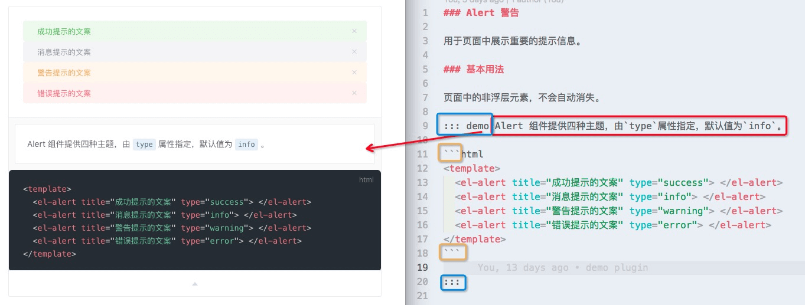

### 新增组件流程

### 一、文件结构

https://github.com/SEG-FE/smart-ui.git

```
|-- packages // 新增 packages 用于存放组件
    |-- components
        |-- alert // 示例组件
            |-- src
                |-- main.vue
            |-- index.js // 导出单个组件
    |-- index.js // 整合所有组件并导出              全局导出
```

### 二、编写组件

> src/main.vue

**注意：name不可省略**

```html
<template>
  <transition name="el-alert-fade">
    <div
      class="el-alert"
      :class="[typeClass, center ? 'is-center' : '', 'is-' + effect]"
      v-show="visible"
      role="alert"
    >
      <i class="el-alert__icon" :class="[ iconClass, isBigIcon ]" v-if="showIcon"></i>
      <div class="el-alert__content">
        <span class="el-alert__title" :class="[ isBoldTitle ]" v-if="title || $slots.title">
          <slot name="title">{{ title }}</slot>
        </span>
        <p class="el-alert__description" v-if="$slots.default && !description"><slot></slot></p>
        <p class="el-alert__description" v-if="description && !$slots.default">{{ description }}</p>
        <i class="el-alert__closebtn" :class="{ 'is-customed': closeText !== '', 'el-icon-close': closeText === '' }" v-show="closable" @click="close()">{{closeText}}</i>
      </div>
    </div>
  </transition>
</template>

<script type="text/babel">
  const TYPE_CLASSES_MAP = {
    'success': 'el-icon-success',
    'warning': 'el-icon-warning',
    'error': 'el-icon-error'
  };
  export default {
    name: 'ElAlert',

    props: {
      title: {
        type: String,
        default: ''
      },
      description: {
        type: String,
        default: ''
      },
      type: {
        type: String,
        default: 'info'
      },
      closable: {
        type: Boolean,
        default: true
      },
      closeText: {
        type: String,
        default: ''
      },
      showIcon: Boolean,
      center: Boolean,
      effect: {
        type: String,
        default: 'light',
        validator: function(value) {
          return ['light', 'dark'].indexOf(value) !== -1;
        }
      }
    },

    data() {
      return {
        visible: true
      };
    },

    methods: {
      close() {
        this.visible = false;
        this.$emit('close');
      }
    },

    computed: {
      typeClass() {
        return `el-alert--${ this.type }`;
      },

      iconClass() {
        return TYPE_CLASSES_MAP[this.type] || 'el-icon-info';
      },

      isBigIcon() {
        return this.description || this.$slots.default ? 'is-big' : '';
      },

      isBoldTitle() {
        return this.description || this.$slots.default ? 'is-bold' : '';
      }
    }
  };
</script>

```

> index.js


```js
// src/index.js
// 导入组件，组件必须声明 name
import Alert from './src/main'

// 为组件提供 install 安装方法，供按需引入
Alert.install = function (Vue) {
    Vue.component(Alert.name, Alert)
}
// 默认导出组件
export default Alert
```

### 三、测试组件

#### 方式一：vue项目

文件位置：example/App.vue
```
npm run serve
```

#### 方式二：markdown

文件位置：example/docs/base/xxx.md
```
npm run docs:dev
```

### 四、编写组件说明文档

> 集成了[vuepress](https://link.juejin.im/?target=https%3A%2F%2Fv1.vuepress.vuejs.org%2Fzh%2F)作为文档编写工具,具体使用请参考官方文档

```
docs
├─ README.md    //首页
├─ .vuepress    //vuepress文件夹
│    ├─ components  //公共组件,该目录中的 Vue 组件将会被自动注册为全局组件。
│    │    └─ demo-block.vue   //DemoBlock组件
│    ├─ config.js   //vuepress配置文件
│    ├─ enhanceApp.js   //客户端应用的增强,相当于vue中的main.js
│    └─ styles  //用于存放样式相关的文件。
│           └─ palette.styl     //用于重写默认颜色常量，或者设置新的 stylus 颜色常量。
├─ base
│    ├─ README.md   // /base/ 路由首页
│    ├─ alert.md    // /base/alert  组件文档
│    └─ tab-list.md
└─ i18n
       └─ component.json
```

1. base文件夹下新增md文件
2. config.js文件，配置侧边栏显示
```
// 为以下路由添加侧边栏
sidebar: {
  '/base/': [{
    title: 'Notice',
    collapsable: false,
    children: [
      'alert',
      'tab-list'
      ...
    ]
  }]
}
```
3. 编写组件文档，demo调试(去掉转义符`\`)

```html
\::: demo Alert 组件提供四种主题，由`type`属性指定，默认值为`info`。
\```html
<template>
  <el-alert title="成功提示的文案" type="success"> </el-alert>
  <el-alert title="消息提示的文案" type="info"> </el-alert>
  <el-alert title="警告提示的文案" type="warning"> </el-alert>
  <el-alert title="错误提示的文案" type="error"> </el-alert>
</template> 
\``` 
\:::
```



### 四、发布

代码`push`到`master`分支

打包文件并发布到npm

登录
```
npm login
```

打包并发版
```
npm run publish
```

更新线上文档
```
npm run docs:build
```
